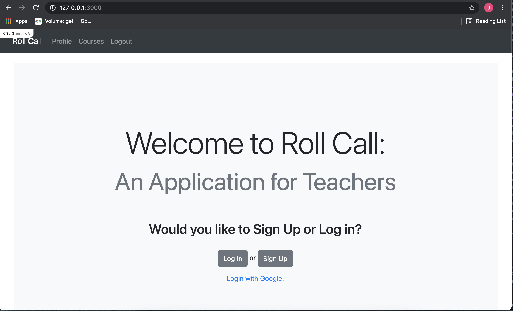

# Roll Call: An Application For Teachers

The user for this application is a teacher/professor/lecturer who wishes to create various courses and add students easily to their courses to track courses, students enrolled, and their grades. If a student is not already in the system they can be added. All of the students' grades and courses they are enrolled in are viewable on the student page. By clicking on a student's grade they can be disenrolled from the course or have their grade changed. 

### [View the Demo](https://youtu.be/IK4bGTv7UMw)
<br>




## Installation

To install program fork the program and copy the ssh link. Navigate to the folder of choice using  ```cd folder_name/``` replacing folder_name with the correct name. Once in the folder type ```git clone ssh_link``` replacing ssh_link with the one that was obtained earlier and hit enter. Before running this program, run ```bundle install``` in the terminal to install necessary gems. To run type ```rails s``` and go to http://127.0.0.1:3000 in browser to use the app.

## Contributors 

If you wish to contribute to this program please submit a pull request or a new issue.

## License

This program is licensed under The MIT License (https://opensource.org/licenses/MIT). License file included.

## Sources

https://rubygems.org/ 

